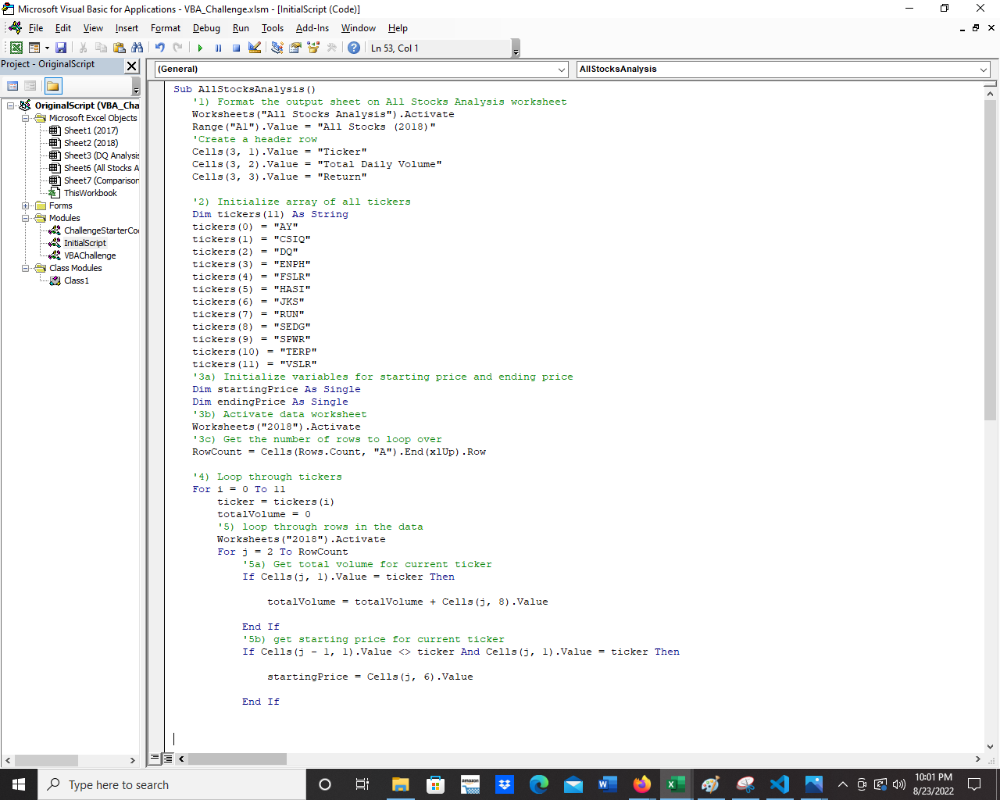
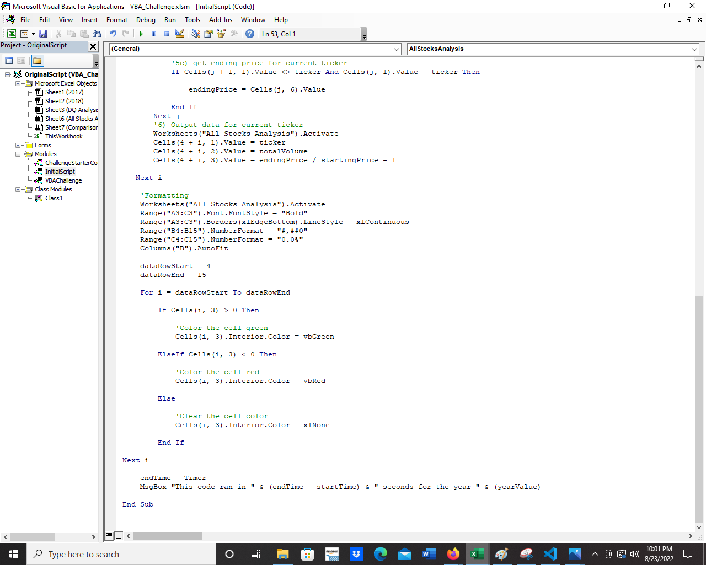
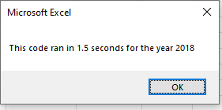
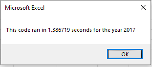
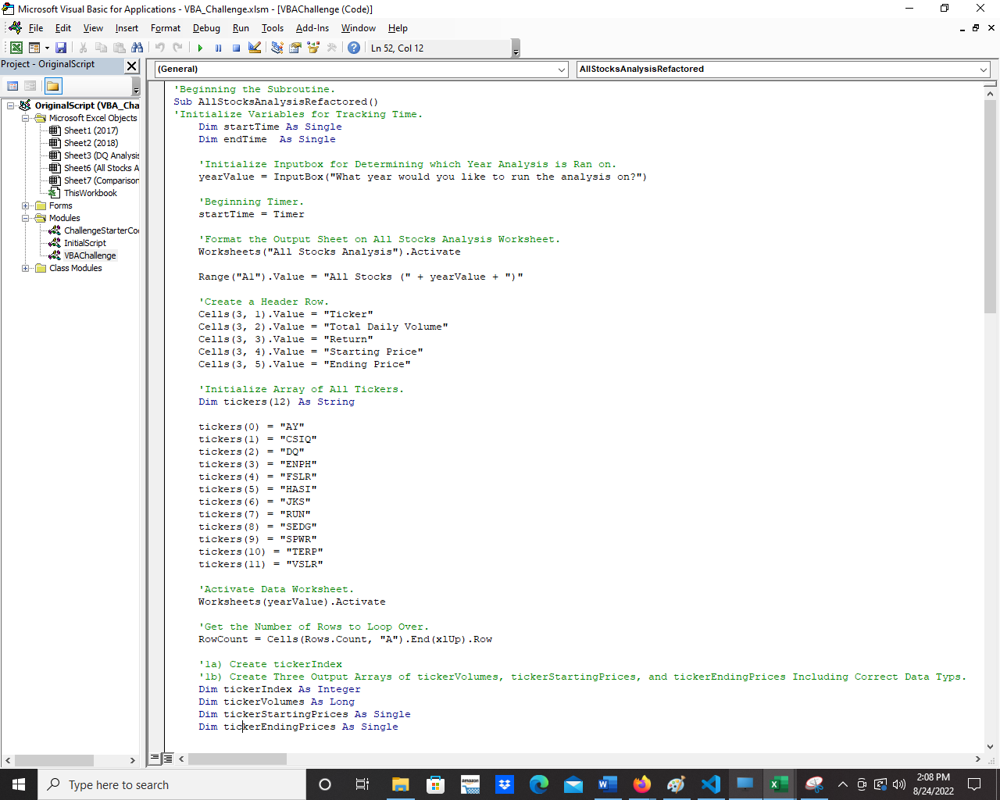
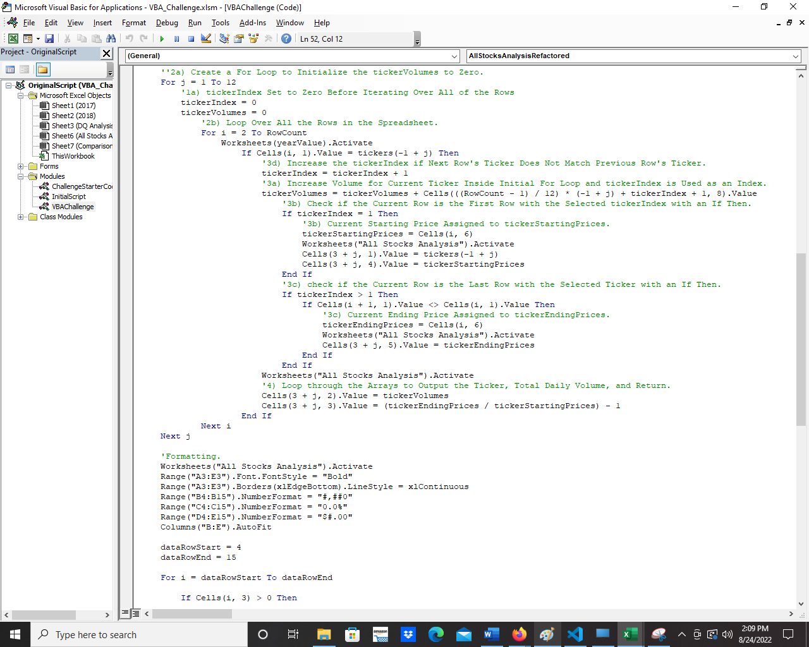
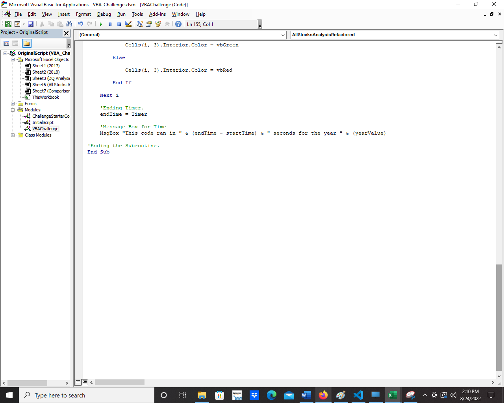
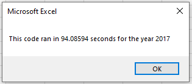
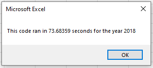

# Stock Analysis with Visual Basic for Applications: Performing Analysis on Stock Data to Determine Daily Volume and Returns

## Overview of Project

### Background
The dataset is a sample of daily corporate stock data from January 2nd to December 31st for days when the exchange was open which excludes weekends and holidays. This dataset includes data for twelve stock tickers for a period of two years. It includes the following data elements in the columns: daily opening price, daily high price, daily low price, daily closing price, daily closing price after adjustments, and daily trade volume. The twelve stock tickers are as follows: AY, CSIQ, DQ, ENPH, FSLR, HASI, JKS, RUN, SEDG, SPWR, TERP, and VSLR.

### Purpose

The purpose of this analysis is to generate a visual representation in tabular format for an aggregate total of the daily trade volume and total returns by percentage between the first daily closing price, designed as starting price, and the last daily closing price, designed as ending price, per each stock ticker for the calendar year period. This will allow us to determine which stocks have been traded the most over the two-year period for each calendar year and what the returns have been for investments in those stocks over the two-year period from start to end of each calendar year.

## Results

### Original Script Performance

The original script for the module 2 solution appears as such.

This code delivers only the 2018 values for the stock tickers. The execution time is displayed below.

An edit of the original script to return 2017 values was made and the execution time for 2017 values is displayed below.

### Refactored Script Performance

The current refactored script appears as such which returns the same values for 2017 and 2018 as the original script. Note that the variable tickerIndex is initialized and utilized to call and/or to compile the values for the variables of ticker, tickerVolume, tickerStartingPrice, and tickerEndingPrice. Also, note that additional code is added to output the starting and ending prices for each stock ticker.

It can be initialed to deliver both 2017 and 2018 values. The execution times are displayed below.

### Stock Performance in 2017

.png)

In 2017, the stocks performed with the following metrics: AY had a daily trade volume of 136,070,900 and a total return of 8.9%, CSIQ had a daily trade volume of 310,592,800 and a total return of 33.1%, DQ had a daily trade volume of 35,796,200 and a total return of 199.4%, ENPH had a daily trade volume of 221,772,100 and a total return of 129.5%, FSLR had a daily trade volume of 684,181,400 and a total return of 101.3%, HASI had a daily trade volume of 80,949,300 and a total return of 25.8%, JKS had a daily trade volume of 191,632,200 and a total return of 53.9%, RUN had a daily trade volume of 267,681,300 and a total return of 5.5%, SEDG had a daily trade volume of 206,885,200 and a total return of 184.5%, SPWR had a daily trade volume of 782,187,000 and a total return of 23.1%, TERP had a daily trade volume of 139,402,800 and a total return of (7.2)%, and VSLR had a daily trade volume of 109,487,900 and a total return of 50.0%.

### Stock Performance in 2018

.png)

In 2018, the stocks performed with the following metrics: AY had a daily trade volume of 83,079,900 and a total return of (7.3)%, CSIQ had a daily trade volume of 200,879,900 and a total return of (16.3)%, DQ had a daily trade volume of 107,873,900 and a total return of (62.6)%, ENPH had a daily trade volume of 607,473,500 and a total return of 81.9%, FSLR had a daily trade volume of 478,113,900 and a total return of (39.7)%, HASI had a daily trade volume of 104,340,600 and a total return of (20.7)%, JKS had a daily trade volume of 158,309,000 and a total return of (60.5)%, RUN had a daily trade volume of 502,757,100 and a total return of 84.0%, SEDG had a daily trade volume of 237,212,300 and a total return of (7.8)%, SPWR had a daily trade volume of 538,024,300 and a total return of (44.6)%, TERP had a daily trade volume of 151,434,700 and a total return of (5.0)%, and VSLR had a daily trade volume of 136,539,100 and a total return of (3.5)%.

### Comparison between 2017 and 2018

.png)

From 2017 to 2018, the stocks in the sample generally performed worse in terms of both total daily trading volume and returns although not all had done so. The differences of the 2018 values in comparison to the 2017 values are as follows: AY had an annual difference in daily trade volume of (52,991,000) and an annual difference in total return of (16.2)%, CSIQ had an annual difference in daily trade volume of (109,712,900) and an annual difference in total return of (49.4)%, DQ had an annual difference in daily trade volume of 72,077,700 and an annual difference in total return of (262.0)%, ENPH had an annual difference in daily trade volume of 385,701,400 and an annual difference in total return of (47.6)%, FSLR had an annual difference in daily trade volume of (206,067,500) and an annual difference in total return of (141.0)%, HASI had an annual difference in daily trade volume of 23,391,300 and an annual difference in total return of (46.5)%, JKS had an annual difference in daily trade volume of (33,323,200) and an annual difference in total return of (114.4)%, RUN had an annual difference in daily trade volume of 235,075,800 and an annual difference in total return of 78.4%, SEDG had an annual difference in daily trade volume of 30,327,100 and an annual difference in total return of (192.2)%, SPWR had an annual difference in daily trade volume of (244,162,700) and an annual difference in total return of (67.7)%, TERP had an annual difference in daily trade volume of 12,031,900 and an annual difference in total return of 2.2%, and VSLR had an annual difference in daily trade volume of 27,051,900 and an annual difference in total return of (53.5)%.

## Summary

### Advantages and Disadvantages of Refactoring Code

Refactoring code is when we edit code to collect the same information and perform the same functionality. 

Refactoring code has some advantages insofar as we can save time as to not write the entire code and determine the needs of the code, we can improve the time and memory-use efficiency and legibility of already written code, can improve understanding of the operations of the code, and may open opportunities to discover possible improvements in functionalities.

Disadvantages of refactoring code include spending resources such as time on developing code while not achieving any further functionality, resources spent on refactoring code may not be worth the improvements in time or memory-use efficiency, if other developers use the code then coordination of relaying changes may be necessary, and improvements may not be easily determinable from end-use consumers if functionality does not change.

### Positives and Negatives of Refactoring the Original VBA Script

Positives to refactoring the original VBA script was improved understanding of how this code works, improved functionality for operating the code to obtain outputs for different inputs without necessitating editing lines of the code, and improved ability to maintain the code with the inclusion of the index which eases our understanding of determining the calculation for aggregate volume, starting price, and ending price.

Negatives for refactoring the original script was time spent on editing a code that had already be able to achieve the desired functionality as well as the additional calculation of placement of values for the index which can slow down the runtime of the code below the original script.
